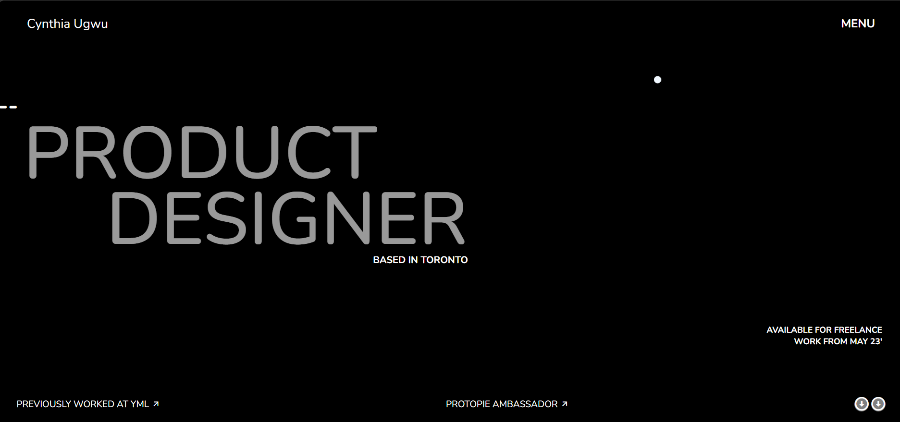
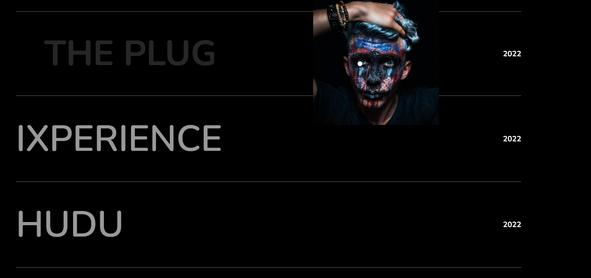
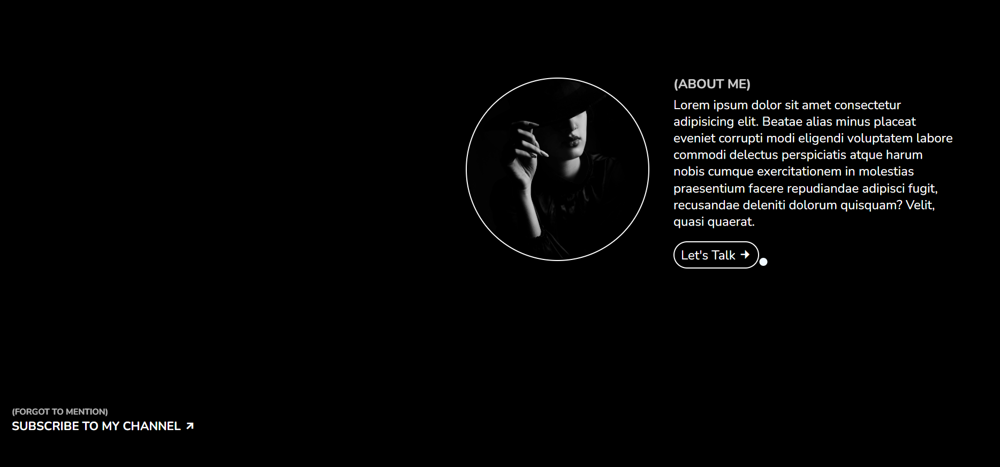

# Cynthia Ugwu Portfolio Clone

A recreation of **Cynthia Ugwu's portfolio website** built as a frontend learning project while following a Sheryians Coding School tutorial.

## About

This project started as a guided frontend exercise and gradually became an opportunity to experiment with layouts, animations, interactions, and responsive styling.

While following the tutorial, I implemented the overall structure and design while also making personal adjustments and adding interactive effects to better understand how the different parts of the website work together.

## Features

- Responsive portfolio layout
- Custom typography and styling
- Smooth scrolling and animated transitions
- Interactive landing page animations
- Cursor-following and responsive mouse effects
- Project image hover interactions
- Text hover effects
- GSAP-powered animations
- Responsive positioning and layout

## Technologies Used

- HTML5
- CSS3
- JavaScript
- GSAP

## What I Learned

- Structuring complex webpage layouts
- Working with CSS positioning and responsive units
- Creating responsive layouts
- Using CSS transitions and animations
- Manipulating elements with JavaScript
- Handling mouse events and interactive effects
- Creating animations with GSAP
- Debugging interactions involving positioning, transforms, and pointer events

## Preview

### Landing Page

### Projects Section

### About Section

## Credits

This project was built as a learning exercise while following the **Cynthia Ugwu Portfolio Clone** tutorial by **Sheryians Coding School**.

The original portfolio design and concept belong to **Cynthia Ugwu**.

The implementation includes personal changes to the styling, layout, animations, and interactive behavior made while experimenting and learning throughout the project.

## Disclaimer

This project is created for educational purposes only. It is a recreation of an existing portfolio website and is not intended to represent the original work as my own.
